# Event sourcing fundamentals

---

layout: two-cols-title
side: l
color: amber-light

---

:: title ::

# What is event sourcing?

:: left ::

### Active record pattern

**State is the source of truth**

- An interpretation of what happened
- Can be changed by anyone
- Hard to know what and why something changed

:: right ::

<v-click>

### Event sourcing

**Events is the source of truth**

- Factual statements about what happened
- Immutable
- Sequential
- Derived state projections from the events

</v-click>

---

layout: side-title
side: l
color: amber-light
align: cm-lm

---

:: title ::

# What are Events?

:: content ::

- Factual statements about what happened
- Immutable
- Content
  - Who, what, when, where, why

**Best practices**

- Small and focused
- Not CRUD on entities
- Part on a short lived process

---

layout: two-cols
align: cm-cm
color: amber-light

---

:: title ::

# Events are immutable

:: left ::

  <ObjectBox>
    

      <b>Update</b>
    

    

        
Name: Contract

        
kek: Sup2

        
Supplier: Sup1

    

  </ObjectBox>

<Arrow v-click="1" x1="350" y1="250" x2="610" y2="200" />
<Arrow v-click="2" x1="350" y1="280" x2="610" y2="340" />

:: right ::

  <ObjectBox v-click="1">
    

      <b>Some operation</b>
    

  </ObjectBox>

  <ObjectBox v-click="2">
    

      <b>Some operation</b>
    

  </ObjectBox>

---

layout: default
color: amber-light

---

# Aggregates

**A collection of related events modeling a process**

**Best practices**

- Keep business logic inside an aggregate
- Avoid big agregates

<!--
- Keep business logic inside an aggregate (easier transactional guarantees)
-->

---

layout: default
color: amber-light

---

# Command handlers

**Commands**

- Expression of intent
- Coming from end users, internal or external systems

**Command handlers**

- Application logic that receives users or system input, and potentially writes new events
- Build existing aggregate by loading events
- Validates the command
- Writes new events to the event store

---

layout: default
color: amber-light

---

# Event example with flow chart

---

layout: two-cols-title
color: amber-light

---

:: title ::

# Event sourcing benefits 🚀

:: left ::
**Development speed**

- Consistent and dependable patterns
- New features often require minimum or no toucing of old code

**Simplifies complexity**

- Overengineered?
- This approach worsk for complex, process driven domains (aka Ignite)

:: right ::
**Auditable by design**

- Immutable log of events
- The past cannot be altered
- For domains that need **compliance**

**Debuggable by design**

- Does equal no bugs 🐛
- But we can audit the log and replay the events and find exactly what went wrong
- We can write a test and replay the events to verify the logic
- Very useful in domains with changing requirements (aka Ignite)

---

layout: default
color: amber-light

---

# Event sourcing benefits 🚀

**When to use event sourcing**

<ul>
<v-clicks every="2">
<li>Is the domain complex?</li>
<li>Is the domain process driven?</li>
<li>Is the domain audit and compliance required?</li>
<li>Will the domain's requirements change frequently?</li>
</v-clicks>
</ul>

<SpeechBubble position="bl" shape="round"  color='amber-light' v-drag="[625,250,274,57]" v-click="3">
Is any of the above true?
</SpeechBubble>

<SpeechBubble position="r" shape="round" animation="float"  color='amber-light' v-drag="[273,391,274,84]" v-click="4">

Consider event sourcing!
</SpeechBubble>

<Planet :size="150" mood="lovestruck" color="#F59E0B" v-drag="[579,341,85,150]" v-click="3" />

---

layout: full
color: amber-light

---

# 🤔 Event sourcing drawbacks

**Heavily reliant on good practices**

- The team needs to know the patterns
- New members need to be educated
- Doing it wrong = tech debt

**Schema maintenance**

- It is not trivial to change the schema

**Small ecosystem**

- Not many production grade libraries
- Can be difficult to find answers

---

layout: full
color: amber-light

---

# Domain Driven Design

**Code matches the business domain language**

- Originating from domain experts
- Ubiquitous language

**Best practices**

---

layout: full
color: amber-light

---

# Domain driven design

**Knowledge discovery**

```mermaid {theme: 'amber-light', scale: 0.8}
graph LR
    A[🧠 Domain knowledge] ---|Discovery 🔍| B(🤔 Mental model)
    B ---|Design 📐| C{🧩 Solution model}
    C ---|Implementation | D[</CODE> Code 💻]
    linkStyle 0,1,2 stroke:#333,stroke-width:2px,stroke-dasharray: 5 5;
    style A fill:#f9f,stroke:#333,stroke-width:2px
    style B fill:#ccf,stroke:#333,stroke-width:2px
    style C fill:#9f9,stroke:#333,stroke-width:2px
    style D fill:#ffc,stroke:#333,stroke-width:2px
```

**Ubiquitous language**

> "Common sense is not so common"
>
> -- Voltaire

<!--
This is practiced to some degree, but I am repeating as I think it is very important for out success.

To design an effective software solution, we at least needs to grasp the the basic knowledge of the business domain.

By no means should we, nor can we, become domain experts.

But it is crucial for us to understand the domain experts and to use the same business terminology they use.

To be effective, the software needs to mimic the domain experts' way of thinking about the problem -- their mental model.

Graph:
- Domain knowledge into an analysis model
- Analysis model into a requirements
- Requirements into system design
- System design into code
-->
