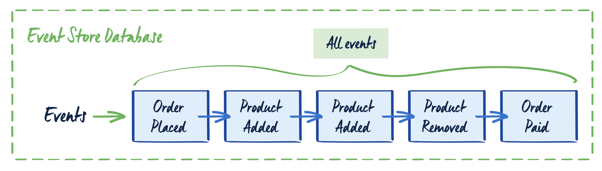
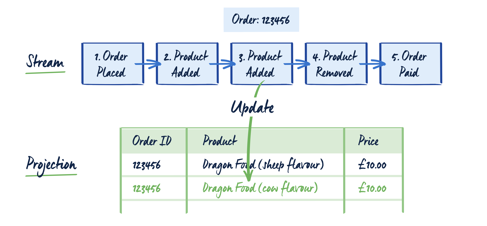
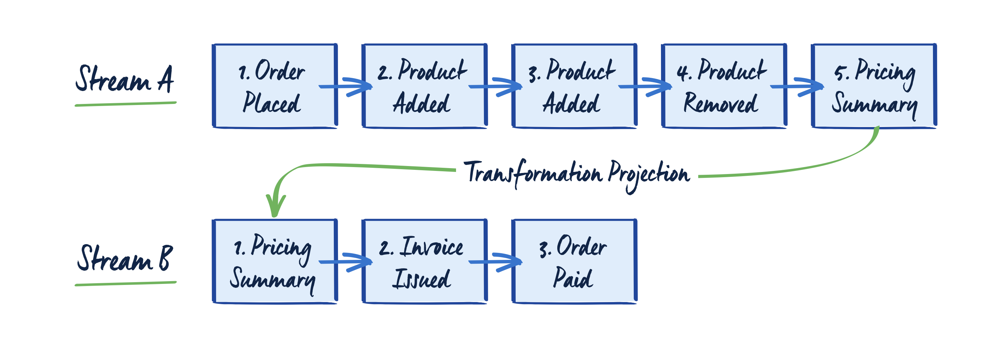
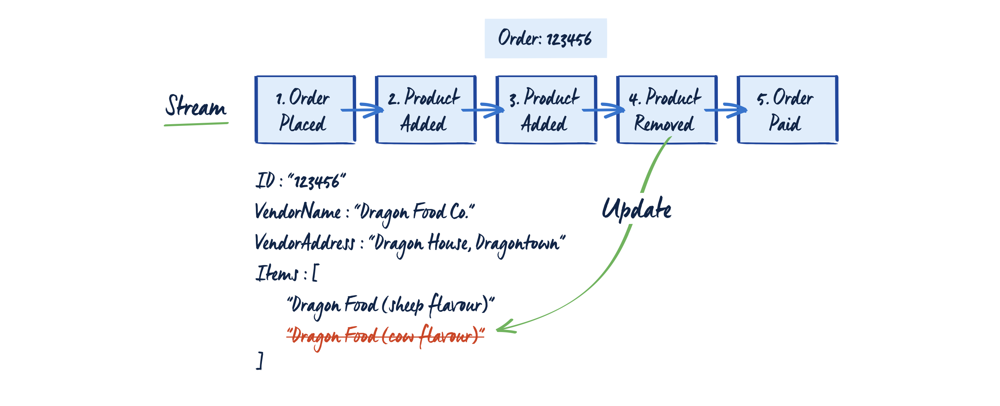
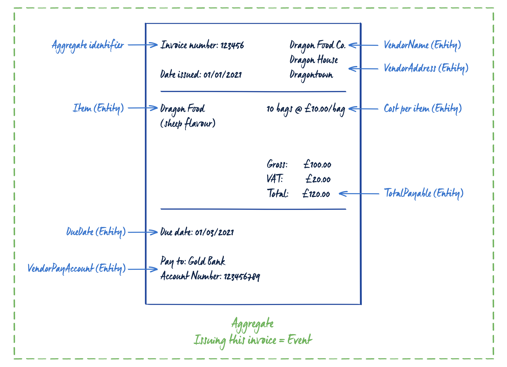
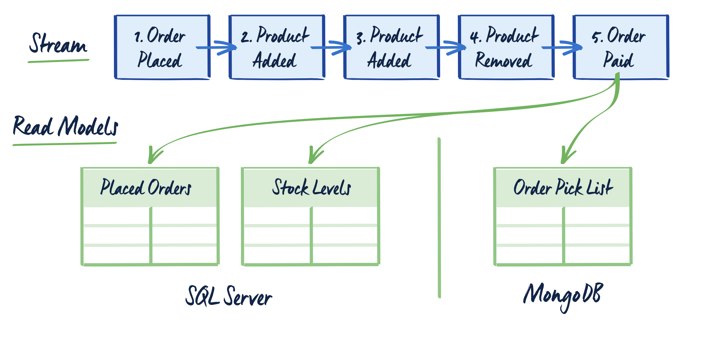
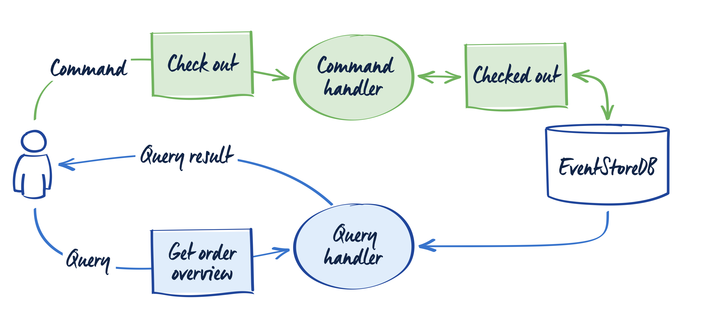
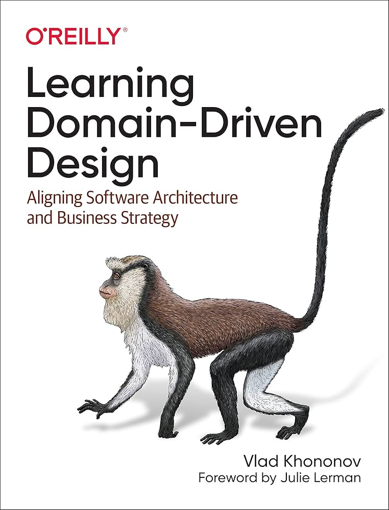
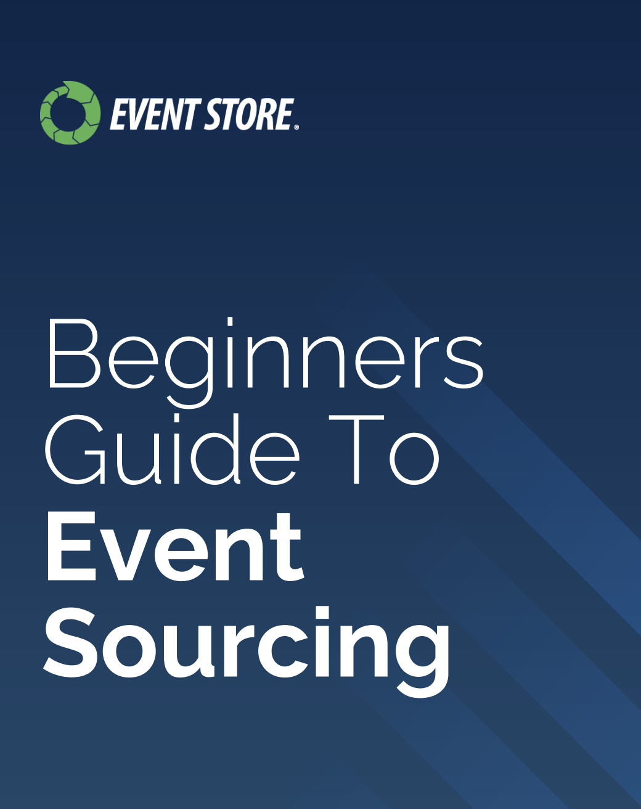
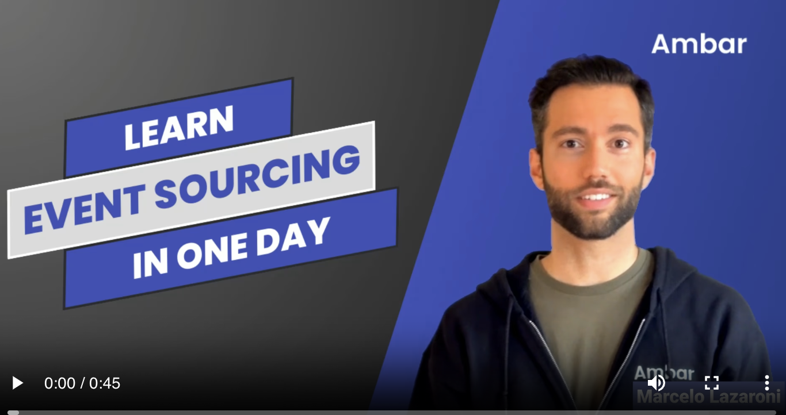

---
# You can also start simply with 'default'
theme: neversink
color: amber-light
# random image from a curated Unsplash collection by Anthony
# like them? see https://unsplash.com/collections/94734566/slidev
background: ./assets/images/coding.png
# some information about your slides (markdown enabled)
title: Domain Driven Design & Event Sourcing
# apply unocss classes to the current slide
class: text-center
# https://sli.dev/features/drawing
drawings:
  persist: false
# slide transition: https://sli.dev/guide/animations.html#slide-transitions
transition: none
# enable MDC Syntax: https://sli.dev/features/mdc
mdc: true
---

An introduction to

### Domain Driven Event Sourcing

---
layout: side-title
align: lm-lm
color: amber-light
titlewidth: is-6
---

:: title ::

# What is ==event sourcing==?

<div class="pt-30px leading-relaxed">
Event sourcing is a pattern where changes that occur in a business domain are immutably stored as events in an append-only store.
</div>

:: content::


- Provides the business with richer data
- Allows for replay of events to derive current state
- Allows for audit and compliance
- Allows for testing by replaying events
- Each event contains the context of the change: the what, when, who, where, why

<!--
This provides a business with richer data as each change that occurs within the domain is
stored as a sequence of events which can be replayed in the order they occurred. This
means you’re able to see more than just the current state of your domain - you can see what
lead up to the current state.

In addition, as events also contain the context of the change – the ‘what’, ‘when’,‘why’ and ‘who’ - an event-sourced system has a wealth of information that can be incredibly valuable
to the business.
-->

---
layout: side-title
align: lm-lm
color: amber-light
titlewidth: is-5
---

:: title ::

# Event sourcing

:: content ::

**Without event sourcing [CRUD]**


<v-click>

**Event sourcing**

</v-click>

<!--
A customer places an order and an invoice is raised with the order details. The current status
of the domain is 'outstanding' with the amount the customer owes, in this case '$200'.

The customer receives the invoice and pays the bill, the current status is then updated to
show the outstanding balance as zero.


second image:

In an event sourced system, the status change would be captured as an event
'OrderPaymentReceived' and stored in the append-only log in the order in which it occurred.
-->

---
layout: side-title
align: lm-lm
color: amber-light
titlewidth: is-5
---

:: title ::

# Event sourcing

:: content ::


<!--
Another example, is an order discount. Let's say the customer placed an order, then a
discount was applied. In a system that only captures the current state, you'll see the
'Outstanding' amount changed from $200 to $150 and won't know why. In an event sourced
system, the change is captured in the event 'DiscountApplied'
, giving the context of the
change - in this case a discount was applied.

Event Sourcing offers a lot of benefits to a business by providing much deeper and richer
context to the changes that happen within a domain. Let's take a look at some of those
benefits.
-->

---
layout: two-cols-title
color: amber-light
---

:: title ::

# Benefits of event sourcing 🚀

:: left ::

🔍 **Auditable** <br/>
An event-sourced system stores data as a series of immutable events over time, providing one of the strongest audit log options available.

🕒 **Time travel** <br/>
All state changes are stored, allowing to time travel back and forward in time. Which can be valuable for debugging and analysis.

ℹ️ **Root cause analysis** <br/>
Business events can be tied back to their originating events providing tracability and visibility for entire workflows from start to finish.

:: right ::

<v-click>

🛡️ **Fault tolerant** <br/>
Event sourcing is fundamentally just logs with strong backup and recovery capabilities. Writing the core "source of record" data to the event store enables the rebuilding of downstream projections.

➡️ **Event driven architecture** <br/>
Event sourcing naturally supports event-driven architectures, making it easier to scale and integrate with other systems and build complex business workflows.

🔄 **Asynchronous first** <br/>
Event sourced systems strive for the minimum amount of synchronous
interaction; consistency boundaries are consciously chosen so that business
requirements are met, and everything else is eventually consistent. This
results in responsive, high performance, scalable systems.

</v-click>

---
layout: two-cols-title
color: amber-light
---

:: title ::

# Benefits of event sourcing 🚀

:: left ::

🤖 **Service autonomy** <br/>
If any service is down, the depending services can "catch up" when the service is back online by replaying the events.

🔄 **Replay and reshape** <br/>
The event can be replayed and transformed to provide new insights and analytics. For instance it can be replayed into any point in time and be the basis of a what-if analysis to project potential future outcomes.

👁️ **Observability** <br/>
Event sourcing provides excellent observability into system behavior and state changes over time, making it easier to monitor, debug, and understand system dynamics. What is uniquely powerful is that the events
can contain the business context which allows real-time analytics.

:: right ::

<v-click>

⬇️ **One way data flow** <br/>
Data in a CQRS flows one way, through independent models to update and read information. This brings an improved ability to reason about the data and debug as each component in the data flow has a single responsibility.

📦 **Migration** <br/>
Migration of legacy systems to modern distributed architectures can be
carried out incrementally, gradually replacing specific pieces of functionality
with event-sourced services. Existing read paths of the legacy system can
remain in place while writes are directed to the services.

</v-click>

---
layout: full
color: amber-light
---

# 🤔 Event sourcing drawbacks

**Heavily reliant on good practices**

- The team needs to know the patterns
- New members need to be educated
- Doing it wrong = tech debt

**Small ecosystem**

- Not many production grade libraries
- Can be difficult to find answers
- But I have found this to be improving and growing lately

---
layout: side-title
align: cm-lt
color: amber-light
titlewidth: is-4
---

:: title ::

# Core Principles of Event Sourcing

:: content ::

# Events

Events are referred to in past tense, and represents the specific business facts.


**Event model content**

- **When** The timestamp of the event <br/>
- **What** The unique identifier of the subject <br/>
- **Who** The user or system that caused the event <br/>
- **Why** The specific business event that occurred <br/>

<!--
- For example:
"Product added" shows the state of the shopping cart has definetly changed, rather than just come into beeing in the state model.

The exact definition of an event is going to depend on
the business use case, and should reflect your business data.

exapmles:
e.g. "RenewedContract"
e.g. "InvoiceIssued"

uniques identifier: e.g ID reference to the contract 

We want to keep the events as small and focused as possible, and not include any business logic. That would be up to the read models and queries to provide the business insights.

It’s this implicit information in the event name ‘InvoiceIssued’
, along with the metadata and
the immutable nature of the event store that makes it an excellent solution for extracting
more useful, in-depth insights and context for the business.
-->

---
layout: top-title
color: amber-light
titlewidth: is-4
---

:: title ::

# Core Principles of Event Sourcing

:: content ::

```ts {1-7|7-12|7-19|all}
// Event model for initiatives in Reduce
model Initiative {
  id         String     @id @default(uuid(7))
  tenant     String     @default(dbgenerated("current_setting('app.tenant'::text)"))
  activities Activity[]
  @@index([tenant, id])
}

model Activity {
  seqNumber Int @default(0) //

  initiativeId String // Where
  initiative   Initiative @relation(fields: [initiativeId], references: [id])

  createdAt DateTime @default(now()) // When
  createdBy String // Who
  requestId String @default(dbgenerated("gen_random_uuid()"))
  type String // why eg. "InitiativeCreated" || "InitiativeStarted"
  key   String // what
  value Json // What

  @@id([initiativeId, seqNumber])
  @@index([tenant, initiativeId])
}
```

<!--
model Initiative {
  id         String     @id @default(uuid(7))
  tenant     String     @default(dbgenerated("current_setting('app.tenant'::text)"))
  activities Activity[]
  @@index([tenant, id])
}

model Activity {
  seqNumber Int @default(0)
  initiativeId String // Where
  initiative   Initiative @relation(fields: [initiativeId], references: [id], onDelete: Cascade)
  createdAt DateTime @default(now()) // When
  createdBy String // Who
  requestId String @default(dbgenerated("gen_random_uuid()")) // Convenience field to group events from the same request
  key   String // What / why
  value Json // What

  @@id([initiativeId, seqNumber])
  @@index([tenant, initiativeId])
}

Each change that took place in the domain is recorded in the database. Event-native
databases are natively focused on storing events. Usually, they do that by having the
append-only log as the central point.

Event-native databases are a different kind of database from traditional databases (graph,
document, relational etc). They are specifically designed to store the history of changes, the
state is represented by the append-only log of events. The events are stored in chronological
order, and new events are appended to the previous event.

The events are immutable: they cannot be changed. This well-known rule of event stores is
often the first defining feature of event stores and Event Sourcing that most people hear, and
is absolutely true, from a certain point of view.

The events in the log can’t be changed, but their effects can be altered by later events. For
example, there may be an ‘InvoiceIssued’ event appended to the log one day, only for it to be
announced that the address the invoice was issued to is incorrect. A new event can be
added, with the ‘InvoiceVoided’ event, then another event with the corrected address and an
‘InvoiceIssued’ event. All three events are stored, all are still immutable, but the desired
outcome is achieved: an invoice has been issued to the correct address. The events are
immutable, but that does not mean that log cannot be changed.
-->

---
layout: side-title
align: cm-lt
color: amber-light
titlewidth: is-4
---

:: title ::

# Core Principles of Event Sourcing

:: content ::

**Event store**



<!--
Streams
Within the event store, the events referring to a particular domain or domain object are
stored in a stream. Event streams are the source of truth for the domain object and contain
the full history of the changes. You can retrieve state by reading all the stream events and
applying them one by one in the order of appearance.

A stream should have a unique identifier representing the specific object. Each event has its
own unique position within a stream. This position is usually represented by a numeric,
incremental value. This number can be used to define the order of the events while retrieving
the state. It can be also used to detect concurrency issues.

Event stores are built to be able to store a huge number of events efficiently. You don’t need
to be afraid of creating lots of streams, however, you should watch the number of events in
those streams. Streams can be short-lived with lots of events, or long-lived with fewer
events. Shorter-lived streams are helpful for maintenance and makes versioning easier.
-->

---
layout: side-title
align: cm-lt
color: amber-light
titlewidth: is-4
---

:: title ::

# Core Principles of Event Sourcing

:: content ::

**Projections**



<v-click>

</v-click>

<!--
In Event Sourcing, Projections (also known as View Models or Query Models) provide a view
of the underlying event-based data model. Often they represent the logic of translating the
source write model into the read model. They are used in both read models and write
models.

Projections In The Read Model
A common scenario in this context is taking events created in the write model (e.g.
InvoiceIssued, OrderPlaced, PaymentSubmitted, OrderItemAdded, InvoicePaid,
OrderConfirmed) and calculating a read model view (e.g. an order summary containing the
paid invoice number, outstanding invoices items, due date status, etc.). This type of object
can be stored in a different database and used for queries.

A set of events can also be a starting point for generating another set of events. For example,
you can take order events, calculate the pricing summary and generate a new order
payment event and place it in another stream. This type of projection is also called
transformation.
-->

---
layout: side-title
align: cm-lt
color: amber-light
titlewidth: is-4
---

:: title ::

# Core Principles of Event Sourcing

:: content ::

**Event aggregation**



<!--
Another form of projection is called stream aggregation. It’s a process of building the current
state of the write model from the stream events. During aggregation, events are applied one
by one in order of appearance. The main purpose of a stream aggregation is to rebuild the
current state to validate an executed command against it.

Projections should be treated as temporary and disposable. This is one of their key benefits
as they can be destroyed, reimagined and recreated at will; they should not be considered
the source of truth.

There is a lot of conceptual crossover between a projection and a read model, and this can
lead to some confusion. The simplest way to understand the relationship between
projections and read models is that a read model is made of multiple projections. 

Theprojections are the method of populating your read model, and represent discrete parts of
the whole read model. For example, a projection can be used to create invoices, and another
can be used as a financial report, both of which are part of the read model.

A common misconception in explaining Event Sourcing is conflating projections with the
state. In Event Sourcing, the source of truth is the events, and the state of the application is
derived from these events. Facts are stored in events; projections are an interpretation of that
raw data.
-->

---
layout: side-title
align: cm-lt
color: amber-light
titlewidth: is-4
---

:: title ::

# Related Terms

:: content ::

**Write Model**



<!--
The write model is responsible for handling the business logic. If you’re using CQRS, then this
is the place where commands are handled. The write model has two aspects: physical and
logical. The physical aspect relates to how and where data is stored, and the logical aspect
reflects the business domain recreated in code structures, and can also be referred to as the
Domain Model. Contrary to the traditional anaemic model, it not only contains the data but
also the methods to change the data and validate it. The logic within the write model should
be as close as possible to the business processes; you should be able to read the code and
fully understand the business requirements from the code.
Let’s take an example: a write model for issuing invoices. It has data, e.g. amounts, vendor
names, invoice numbers, and methods like “Issue Invoice”
. 

It has rules such as “each invoice number must be unique”,“each invoice must contain a vendor name” etc. By having the
design of the system derived from the domain, we can keep all the business logic and data in
one place. A write model is essential, but a read model is not always needed.
A useful pattern to consider while implementing the write model is the aggregate. It is
responsible for maintaining data consistency, and by using it we’re making sure that all
related data will be stored in a single, atomic transaction. Aggregates are not necessary, but
they are very common.

In Domain Driven Design, Eric Evans discusses the granular nature of objects, and provides a
definition of an aggregate. From the Domain Driven Design “blue” book:
“An aggregate is a cluster of associated objects that we treat as a unit for the purpose of data
changes. Each aggregate has a root and a boundary. The boundary defines what is inside the
aggregate. The root is a single, specific entity contained in the aggregate.

Aggregates are the consistency guards. They take the current state, verify the business rules
for the particular operation (e.g. if there is no invoice with the same number) and apply the
business logic that returns the new state. The important part of this process is storing all or
nothing. All aggregated data needs to be saved successfully. If one rule or operation fails
then the whole state change is rejected.

In Event Sourcing, each operation made on the aggregate should result with the new event.
For example, issuing the invoice should result in the InvoiceIssued event. Once the event has
happened, it is recorded in the event store.

It’s easy to assume that because there are aggregates, you can have one mega aggregate.
However, this will cause more problems in the long run. Smaller, more concise aggregates
that focus on one aspect will make a more efficient system overall and preserve the business
context where needed. As an example, consider the invoice aggregate. A VAT validation
process would not need all the information contained in the invoice, so this process could be
a smaller, more concise aggregate. This preserves the business context where it’s needed.
-->

---
layout: side-title
align: cm-lt
color: amber-light
titlewidth: is-4
---

:: title ::

# Related Terms

:: content ::

**Read model**



<!--
Queries in CQRS represent the intention to get data. A read model contains specific
information. For example, the read model contains all the invoice information (the amount,
the due date, etc) and the query represents the intention to know something about the
invoice, such as whether or not it has been paid.

The read model can be, but doesn’t have to be, derived from the write model. It’s a
transformation of the results of the business operation into a readable form.
As stated in the Projections section, read models are created by projections. Events
appended in the event store triggers the projection logic that creates or updates the read
model.

The read model is specialised for queries. It’s modelled to be a straightforward output that
can be digested by various readers. It can be presented in many different ways, including a
display on a monitor, an API, another dependent service or even to create the PDF of the
invoice. In short, a read model is a general concept not tied to any type of storage.

However, the read model does not have to be permanent: new read models can be
introduced into the system without impacting the existing ones. Read models can be deleted
and recreated without losing the business logic or information, as this is stored in the write
model.
-->

---
layout: side-title
align: cm-lt
color: amber-light
titlewidth: is-4
---

:: title ::

# Related Terms

:: content ::

**Domain Driven Design**

- Method for optimizing a team’s understanding of a problem space, and how to work in that space.
- Ubiquitous language is core
- Takes the developer away from the purely technical and theoretical world, and imposes a reality on their development skills.
- Enforces collaboration between the business and the development team.
- Combined with Event Sourcing, it forces the devlopers to think about the actual domain events and how they map to the business processes.

<!--
- Domain Driven Design (DDD) is a method for optimizing a team’s understanding of a problem
space, and how to work in that space. 

- At its core, it’s about having a ubiquitous language
between the terms used by the business users and the development team. This unification of
language can be extremely useful when translating the problem concept into functioning
software.

Domain Driven Design was first coined by Eric Evans in his seminal work Domain-Driven
Design: Tackling Complexity in the Heart of Software. Evans took his experience and fused the
business process and the implementation as a first step in the design process, then created a
ubiquitous language based on that first step. He realised the importance of using a common
language to collaborate efficiently on the project.

Domain Driven Design is important because it requires meaningful and continued
collaboration between the architect and the product owner. It takes the developer away from
the purely technical and theoretical world, and imposes a reality on their development skills. It
also forces the product owner (or customer) to think through what they require from the
system and recognise the capabilities of it. By making all the stakeholders cooperate, a shared
understanding is created, and progress is more efficient.

The creation of a ubiquitous language involves Knowledge Crunching, the process of taking
unRelated Terms from business and development and creating something from the scattered
terms. It’s collaborative, it can be messy, but can also be the beginning of a beautiful
friendship.

Using Domain Driven Design with Event Sourcing is not mandatory. However, the main
concepts such as speaking the same language as the business and proper business process
modelling are also good foundations for building an Event Sourcing system. The better
understanding we have of the business processed, the more precise the business information
will be in our events.
-->

---
layout: side-title
align: cm-lt
color: amber-light
titlewidth: is-4
---

:: title ::

# Related Terms

:: content ::

**CQRS**



<!--
CQRS is a development of CQS, which is an architectural pattern, and the acronym stands for
Command Query Separation. CQS is the core concept that defines two types of operations
handled in a system: a command that executes a task, a query that returns information, and
there should never be one function to do both of these jobs. The term was created by
Bertrand Meyer in his book ‘Object-oriented Software Construction’ (1988, Prentice Hall).
CQRS is another architectural pattern acronym, standing for Command Query Responsibility
Segregation. It divides a system’s actions into commands and queries. The two are similar,
but not the same. Oskar Dudycz describes the difference as “CQRS can be interpreted at a
higher level, more general than CQS; at an architectural level. CQS defines the general
principle of behaviour. CQRS speaks more specifically about implementation”
.


One of the common misconceptions about CQRS is that the commands and queries should
be run on separate databases. This isn’t necessarily true; only that the behaviours and
responsibilities for both should be separated. This can be within the code, within the structure
of the database, or (if the situation calls for it), different databases.
Expanding on that concept, CQRS doesn’t even have to use a database: It could be run off an
Excel spreadsheet, or anything else containing data.
Event sourcing and CQRS seems like a new and interesting design patterns, but they have
been around for some time. CQRS can feel like a strange new technique, especially after
spending years learning with a foundation based in CRUD. CQRS was described by Greg
Young as a ‘stepping stone towards Event Sourcing’
. It’s important to understand event
sourcing and CQRS do not rely on each other; you can have an event sourced system without
CQRS and you can use CQRS without event sourcing. It’s just that the two work best together.
-->

---
layout: two-cols-title
color: amber-light
---

:: title ::

# More resources

:: left ::

<a href="https://www.adlibris.com/nb/bok/learning-domain-driven-design-9781098100131?utm_source=google&utm_medium=cpc&utm_campaign=AR%3A+BOK+-+pMAX+Shopping+-+Generic+-+B%C3%B6cker+ENG&gad_source=1&gclid=EAIaIQobChMIgPSCpO3jiwMVGkiRBR3p8QrxEAQYASABEgL9dfD_BwE" target="_blank">
  
</a>

:: right ::

<a href="./assets/resources/event-store-ebook-beginners-guide-to-event-sourcing.pdf" download>
  <div class="flex flex-col items-center justify-center " >
    <span>Beginners guide to event sourcing</span>
    
  </div>
</a>

<a href="https://ambar.cloud/event-sourcing-one-day-course" target="_blank">
  <div class="flex flex-col items-center justify-center pt-[50px]" >
    <span>Free course on event sourcing</span>
    
  </div>
</a>
