---
# You can also start simply with 'default'
theme: neversink
color: amber-light
# random image from a curated Unsplash collection by Anthony
# like them? see https://unsplash.com/collections/94734566/slidev
background: ./assets/images/coding.png
# some information about your slides (markdown enabled)
title: Domain Driven Design & Event Sourcing
# apply unocss classes to the current slide
class: text-center
# https://sli.dev/features/drawing
drawings:
  persist: false
# slide transition: https://sli.dev/guide/animations.html#slide-transitions
transition: none
# enable MDC Syntax: https://sli.dev/features/mdc
mdc: true
---

### Domain Driven Event Sourcing

---
layout: side-title
align: lm-lm
color: amber-light
titlewidth: is-6
---

:: title ::

# What is ==event sourcing==?

<div class="pt-30px leading-relaxed">
Event sourcing is a pattern where changes that occur in a business domain are immutably stored as events in an append-only store.
</div>

:: content::

<v-click>

- Provides the business with richer data
- Allows for replay of events to derive current state
- Allows for audit and compliance
- Allows for testing by replaying events
- Each event contains the context of the change: the what, when, who, where, why

</v-click>

<!--
This provides a business with richer data as each change that occurs within the domain is
stored as a sequence of events which can be replayed in the order they occurred. This
means you’re able to see more than just the current state of your domain - you can see what
lead up to the current state.

In addition, as events also contain the context of the change – the ‘what’, ‘when’,‘why’ and ‘who’ - an event-sourced system has a wealth of information that can be incredibly valuable
to the business.
-->

---
layout: side-title
align: lb-lm
color: amber-light
titlewidth: is-5
---

:: title ::

<div class="pb-200px">
  <h1>Event sourcing</h1>
</div>

# ==Example==

:: content ::


<v-click>
  
</v-click>

<!--
A customer places an order and an invoice is raised with the order details. The current status
of the domain is 'outstanding' with the amount the customer owes, in this case '$200'.

The customer receives the invoice and pays the bill, the current status is then updated to
show the outstanding balance as zero.


second image:

In an event sourced system, the status change would be captured as an event
'OrderPaymentReceived' and stored in the append-only log in the order in which it occurred.
-->

---
layout: side-title
align: lb-lm
color: amber-light
titlewidth: is-5
---

:: title ::

<div class="pb-200px">
  <h1>Event sourcing</h1>
</div>

# ==Example==

:: content ::


<!--
Another example, is an order discount. Let's say the customer placed an order, then a
discount was applied. In a system that only captures the current state, you'll see the
'Outstanding' amount changed from $200 to $150 and won't know why. In an event sourced
system, the change is captured in the event 'DiscountApplied'
, giving the context of the
change - in this case a discount was applied.

Event Sourcing offers a lot of benefits to a business by providing much deeper and richer
context to the changes that happen within a domain. Let's take a look at some of those
benefits.
-->

---
layout: two-cols-title
color: amber-light
---

:: title ::

# Benefits of event sourcing 🚀

:: left ::

🔍 **Auditable** <br/>
An event-sourced system stores data as a series of immutable events over time, providing one of the strongest audit log options available.

🕒 **Time travel** <br/>
All state changes are stored, allowing to time travel back and forward in time. Which can be valuable for debugging and analysis.

ℹ️ **Root cause analysis** <br/>
Business events can be tied back to their originating events providing tracability and visibility for entire workflows from start to finish.

:: right ::

<v-click>

🛡️ **Fault tolerant** <br/>
Event sourcing is fundamentally just logs with strong backup and recovery capabilities. Writing the core "source of record" data to the event store enables the rebuilding of downstream projections.

➡️ **Event driven architecture** <br/>
Event sourcing naturally supports event-driven architectures, making it easier to scale and integrate with other systems and build complex business workflows.

🔄 **Asynchronous first** <br/>
Event sourced systems strive for the minimum amount of synchronous
interaction; consistency boundaries are consciously chosen so that business
requirements are met, and everything else is eventually consistent. This
results in responsive, high performance, scalable systems.

</v-click>

---
layout: two-cols-title
color: amber-light
---

:: title ::

# Benefits of event sourcing 🚀

:: left ::

🤖 **Service autonomy** <br/>
If any service is down, the depending services can "catch up" when the service is back online by replaying the events.

🔄 **Replay and reshape** <br/>
The event can be replayed and transformed to provide new insights and analytics. For instance it can be replayed into any point in time and be the basis of a what-if analysis to project potential future outcomes.

👁️ **Observability** <br/>
Event sourcing provides excellent observability into system behavior and state changes over time, making it easier to monitor, debug, and understand system dynamics. What is uniquely powerful is that the events
can contain the business context which allows real-time analytics.

:: right ::

<v-click>

⬇️ **One way data flow** <br/>
Data in a CQRS flows one way, through independent models to update and read information. This brings an improved ability to reason about the data and debug as each component in the data flow has a single responsibility.

📦 **Migration** <br/>
Migration of legacy systems to modern distributed architectures can be
carried out incrementally, gradually replacing specific pieces of functionality
with event-sourced services. Existing read paths of the legacy system can
remain in place while writes are directed to the services.

</v-click>

---
layout: side-title
align: cm-lt
color: amber-light
titlewidth: is-4
---

:: title ::

# Core Principles of Event Sourcing

:: content ::

# Events

Events are referred to in past tense, and represents the specific business facts.


**Event model content**

<div class="ns-c-tight">

- When: The timestamp of the event
- What: The unique identifier of the subject
  - e.g ID reference to the contract
- Who: The user or system that caused the event
- Why: The specific business event that occurred
  - e.g. "RenewedContract"

</div>

<!--
- For example:
"Product added" shows the state of the shopping cart has definetly changed, rather than just come into beeing in the state model.

The exact definition of an event is going to depend on
the business use case, and should reflect your business data.

We want to keep the events as small and focused as possible, and not include any business logic. That would be up to the read models and queries to provide the business insights.

It’s this implicit information in the event name ‘InvoiceIssued’
, along with the metadata and
the immutable nature of the event store that makes it an excellent solution for extracting
more useful, in-depth insights and context for the business.
-->

---
layout: full
color: amber-light
---

# Event sourcing


---
layout: section
side: l
titlewidth: is-5
align: cm-lm
color: amber-light
---

<div >

# Event sourcing fundamentals

</div>

---
layout: two-cols-title
side: l
color: amber-light
---

:: title ::

# What is event sourcing?

:: left ::

### Active record pattern

**State is the source of truth**

- An interpretation of what happened
- Can be changed by anyone
- Hard to know what and why something changed

:: right ::

<v-click>

### Event sourcing

**Events is the source of truth**

- Factual statements about what happened
- Immutable
- Sequential
- Derived state projections from the events

</v-click>

---
layout: side-title
side: l
color: amber-light
align: cm-lm
---

:: title ::

# What are Events?

:: content ::

- Factual statements about what happened
- Immutable
- Content
  - Who, what, when, where, why

**Best practices**

- Small and focused
- Not CRUD on entities
- Part on a short lived process

---
layout: two-cols
align: cm-cm
color: amber-light
---

:: title ::

# Events are immutable

:: left ::

  <ObjectBox>
    <div>
      <b>Update</b>
    </div>
    <div text-left>
        <div>Name: Contract</div>
        <div>kek: Sup2</div>
        <div>Supplier: Sup1</div>
    </div>
  </ObjectBox>

<Arrow v-click="1" x1="350" y1="250" x2="610" y2="200" />
<Arrow v-click="2" x1="350" y1="280" x2="610" y2="340" />

:: right ::

<div style="display: flex; flex-direction: column; gap: 5rem;">
  <ObjectBox v-click="1">
    <div>
      <b>Some operation</b>
    </div>
  </ObjectBox>

  <ObjectBox v-click="2">
    <div>
      <b>Some operation</b>
    </div>
  </ObjectBox>
</div>

---
layout: default
color: amber-light
---

# Aggregates

**A collection of related events modeling a process**

**Best practices**

- Keep business logic inside an aggregate
- Avoid big agregates

<!--
- Keep business logic inside an aggregate (easier transactional guarantees)
-->

---
layout: default
color: amber-light
---

# Command handlers

**Commands**

- Expression of intent
- Coming from end users, internal or external systems

**Command handlers**

- Application logic that receives users or system input, and potentially writes new events
- Build existing aggregate by loading events
- Validates the command
- Writes new events to the event store

---
layout: default
color: amber-light
---

# Event example with flow chart

---
layout: top-title
color: amber-light
---

:: title ::

# Storing events

:: content ::

```ts {1-7|7-12|7-18|all}
model Initiative {
  id         String     @id @default(uuid(7))
  tenant     String     @default(dbgenerated("current_setting('app.tenant'::text)"))
  activities Activity[]
  @@index([tenant, id])
}

model Activity {
  seqNumber Int @default(0) //

  initiativeId String // Where
  initiative   Initiative @relation(fields: [initiativeId], references: [id])

  createdAt DateTime @default(now()) // When
  createdBy String // Who
  requestId String @default(dbgenerated("gen_random_uuid()"))
  key   String // What / why
  value Json // What

  @@id([initiativeId, seqNumber])
  @@index([tenant, initiativeId])
}
```

<!--
model Initiative {
  id         String     @id @default(uuid(7))
  tenant     String     @default(dbgenerated("current_setting('app.tenant'::text)"))
  activities Activity[]
  @@index([tenant, id])
}

model Activity {
  seqNumber Int @default(0)
  initiativeId String // Where
  initiative   Initiative @relation(fields: [initiativeId], references: [id], onDelete: Cascade)
  createdAt DateTime @default(now()) // When
  createdBy String // Who
  requestId String @default(dbgenerated("gen_random_uuid()")) // Convenience field to group events from the same request
  key   String // What / why
  value Json // What

  @@id([initiativeId, seqNumber])
  @@index([tenant, initiativeId])
}
-->

---
layout: two-cols-title
color: amber-light
---

:: title ::

# Event sourcing benefits 🚀

:: left ::
**Development speed**

- Consistent and dependable patterns
- New features often require minimum or no toucing of old code

**Simplifies complexity**

- Overengineered?
- This approach worsk for complex, process driven domains (aka Ignite)

:: right ::
**Auditable by design**

- Immutable log of events
- The past cannot be altered
- For domains that need **compliance**

**Debuggable by design**

- Does equal no bugs 🐛
- But we can audit the log and replay the events and find exactly what went wrong
- We can write a test and replay the events to verify the logic
- Very useful in domains with changing requirements (aka Ignite)

---
layout: default
color: amber-light
---

# Event sourcing benefits 🚀

**When to use event sourcing**

<ul>
<v-clicks every="2">
<li>Is the domain complex?</li>
<li>Is the domain process driven?</li>
<li>Is the domain audit and compliance required?</li>
<li>Will the domain's requirements change frequently?</li>
</v-clicks>
</ul>

<SpeechBubble position="bl" shape="round"  color='amber-light' v-drag="[625,250,274,57]" v-click="3">
Is any of the above true?
</SpeechBubble>

<SpeechBubble position="r" shape="round" animation="float"  color='amber-light' v-drag="[273,391,274,84]" v-click="4">

Consider event sourcing!
</SpeechBubble>

<Planet :size="150" mood="lovestruck" color="#F59E0B" v-drag="[579,341,85,150]" v-click="3" />

---
layout: full
color: amber-light
---

# 🤔 Event sourcing drawbacks

**Heavily reliant on good practices**

- The team needs to know the patterns
- New members need to be educated
- Doing it wrong = tech debt

**Schema maintenance**

- It is not trivial to change the schema

**Small ecosystem**

- Not many production grade libraries
- Can be difficult to find answers

---
layout: full
color: amber-light
---

# Domain Driven Design

**Code matches the business domain language**

- Originating from domain experts
- Ubiquitous language

**Best practices**

---
layout: full
color: amber-light
---

# Domain driven design

**Knowledge discovery**

```mermaid {theme: 'amber-light', scale: 0.8}
graph LR
    A[🧠 Domain knowledge] ---|Discovery 🔍| B(🤔 Mental model)
    B ---|Design 📐| C{🧩 Solution model}
    C ---|Implementation | D[</CODE> Code 💻]
    linkStyle 0,1,2 stroke:#333,stroke-width:2px,stroke-dasharray: 5 5;
    style A fill:#f9f,stroke:#333,stroke-width:2px
    style B fill:#ccf,stroke:#333,stroke-width:2px
    style C fill:#9f9,stroke:#333,stroke-width:2px
    style D fill:#ffc,stroke:#333,stroke-width:2px
```



**Ubiquitous language**

> "Common sense is not so common"
>
> -- Voltaire

<!--
This is practiced to some degree, but I am repeating as I think it is very important for out success.

To design an effective software solution, we at least needs to grasp the the basic knowledge of the business domain.

By no means should we, nor can we, become domain experts.

But it is crucial for us to understand the domain experts and to use the same business terminology they use.

To be effective, the software needs to mimic the domain experts' way of thinking about the problem -- their mental model.

Graph:
- Domain knowledge into an analysis model
- Analysis model into a requirements
- Requirements into system design
- System design into code
-->
